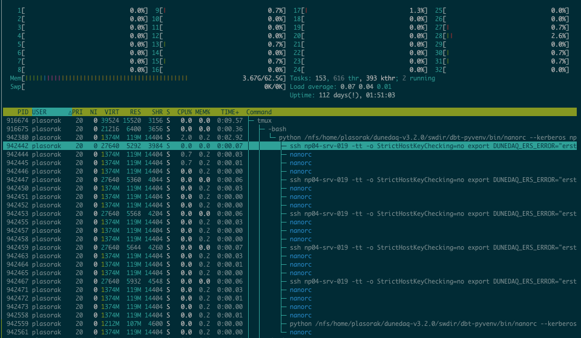
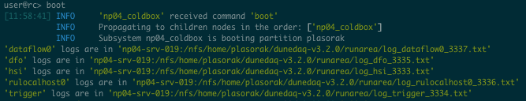

# FAQ

## NanoRC exited ungracefully and all my apps are still running, what do I do?
You'll need to go on each of the servers where the applications where running, run `htop --user ${USER}`, click on the `daq_application` (yes, click on your terminal) to select the app as shown in the image, then `F9` and enter twice.



You can also do the equivalent by doing `ps a|grep daq_application`, note the first number of the line and run `kill <the-number>`.

## NanoRC can't start the response listener, what do I do?
...i.e., you see an error message which looks like the following:
```
                    RuntimeError: Cannot create a response listener!!                                           
           ERROR    json0 went to error!                                                     statefulnode.py:225
```
In this case, you're probably running on the NP04 cluster and you have enabled the web proxy. If so, you can quit nanorc, and run:
```bash
source ~np04daq/bin/web_proxy.sh -u
```
Note that if you do start again right away after `source`ing the web proxy file, you may encounter a message such as
```
Couldn't execute the function boot on the object, reason: The port <hostname>:<portnumber> is already open, likely by another application, cannot continue
```
This port in question is very likely one which is still open from the connectivity service which was started within your previous `nanorc` session. At any rate, you can find what that application is (if it's yours) by going to the host in question and running
```
netstat -tulpn | grep <portnumber>
```
where the second column will give you the PID of the process. Kill it, and when you've confirmed that it's gone, try again. 


## NanoRC won't boot my apps?
There are many reasons why this could happen, here are the 2 most common:
 - You don't have password-less ssh keys (see how to create password-less ssh keys)
 - Somebody else is running on the same server, in which case you need to pass `--partition-number 1` (or any number between 1 and 10) to the `nanorc` command.

## How do I create password-less ssh keys?
Here is the broad idea (but you are welcome to look on Google too):
```bash
ssh-keygen
```
then tap `<Enter>` tree times when prompted where to put the key and for a password (*do not* enter a password here, and the default location for the key is also fine).

Then do:
```bash
ssh-copy-id <the-host-where-you-app-will-run>
```

This command should prompt you a password, for the last time. This is the same password you used to log on the server. After that you can do:
```bash
ssh <the-host-where-you-app-will-run>
```
and you won't be prompted for a password ever again!

## I don't want to create ssh keys, how do I do?
This isn't particularly recommended, but if you are running on the `dunegpvm` you won't have the choice. You can run nanorc with kerberos, by doing `nanorc --kerberos ...`.

## Where are my app logs?
NanoRC tells you where the apps logs are:



If you are using with an older version of nanorc, this message won't be here, in this case 2 choices:
 - you are running with `nanorc`: the logs are in PWD
 - you are running with `nano04rc` or `nanotimingrc`: the logs are in `/log`, and *note that these folders are not shared across the NP04 cluster, so you will need to ssh where the app was running first.*

## I want more logs
Run nanorc like this:
```bash
DUNEDAQ_ERS_DEBUG_LEVEL=10 nanorc conf/ partition_name
```
This will put all the `TLOG_DEBUG` printout of level <= 10 to print.
