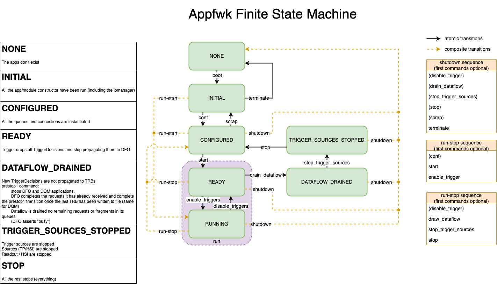
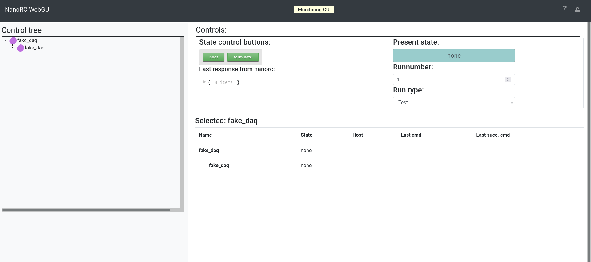

# Nano RC (Not ANOther Run Control)

Poor man's Run Control for DUNE DAQ applications

## How to run me

This tutorial will guide you through the one-host minidaq example.

This tutorial assumes you run on a linux host with /cvmfs mounted, such as lxplus at CERN.

_If you want to run with Kubernetes support, the "Kubernetes support" section is later in this document_

### Setup

First, set up a working area according to [the daq-buildtools instructions](https://dune-daq-sw.readthedocs.io/en/latest/packages/daq-buildtools/).

Get the example data file:

```bash
curl -o frames.bin -O https://cernbox.cern.ch/index.php/s/0XzhExSIMQJUsp0/download
```

Generate a configuration:

```bash 
daqconf_multiru_gen fake_daq
```

Next (if you want to), you can create a file called `top_level.json` which contains:

```json
{
  "apparatus_id": "fake_daq",
  "minidaq": "fake_daq"
}
```
More lines can be added later, each corresponding to a different config. This allows several sets of apps to be run in the same nanorc instance.

Now you're ready to run.

### Running NanoRC

There are 3 nanorc commands:
 - `nanorc`: for normal development,
 - `nano04rc`: for production environment at NP04,
 - `nanotimingrc`: to run the timing global partition.

To see a list of options you can pass `nanorc` in order to control things such as the amount of information it prints and the timeouts for transitions, run `nanorc -h`. We'll skip those for now in the following demo:
```
nanorc top_level.json partition-name# or "nanorc fake_daq partition-name" if you didn't create the top_level.json

╭──────────────────────────────────────────────────────────────────────────╮
│                              Shonky NanoRC                               │
│  This is an admittedly shonky nano RC to control DUNE-DAQ applications.  │
│    Give it a command and it will do your biddings,                       │
│    but trust it and it will betray you!                                  │
│  Use it with care!                                                       │
╰──────────────────────────────────────────────────────────────────────────╯

shonky rc> 
```
To see the commands available use `help`.

```
shonky rc> help

Documented commands (type help <topic>):
========================================
boot              exclude         scrap        stop                
change_rate       expert_command  shutdown     stop_run            
conf              include         start        stop_trigger_sources
disable_triggers  ls              start_run    terminate           
drain_dataflow    message         start_shell  wait                
enable_triggers   pin_threads     status

Undocumented commands:
======================
exit  help  quit
```

`boot` will start your applications. In the case of the example, a trigger application to supply triggers, a hardware signal interface (HSI) application, a readout application and a dataflow application which receives the triggers.
```
shonky rc> boot

  # apps started ━━━━━━━━━━━━━━━━━━━━━━━━━━━━━━━━━━━━━━━━ 100% 0:00:00 0:00:02
  dataflow       ━━━━━━━━━━━━━━━━━━━━━━━━━━━━━━━━━━━━━━━━ 100% 0:00:00 0:00:02
  hsi            ━━━━━━━━━━━━━━━━━━━━━━━━━━━━━━━━━━━━━━━━ 100% 0:00:00 0:00:02
  ruemu0         ━━━━━━━━━━━━━━━━━━━━━━━━━━━━━━━━━━━━━━━━ 100% 0:00:00 0:00:01
  trigger        ━━━━━━━━━━━━━━━━━━━━━━━━━━━━━━━━━━━━━━━━ 100% 0:00:00 0:00:02
                                Apps                                
┏━━━━━━━━━━┳━━━━━━━━━━━┳━━━━━━━┳━━━━━━━┳━━━━━━━━━━┳━━━━━━━━━━━━━━━━┓
┃ name     ┃ host      ┃ alive ┃ pings ┃ last cmd ┃ last succ. cmd ┃
┡━━━━━━━━━━╇━━━━━━━━━━━╇━━━━━━━╇━━━━━━━╇━━━━━━━━━━╇━━━━━━━━━━━━━━━━┩
│ dataflow │ mu2edaq13 │ True  │ True  │ None     │ None           │
│ hsi      │ mu2edaq13 │ True  │ True  │ None     │ None           │
│ ruemu0   │ mu2edaq13 │ True  │ True  │ None     │ None           │
│ trigger  │ mu2edaq13 │ True  │ True  │ None     │ None           │
└──────────┴───────────┴───────┴───────┴──────────┴────────────────┘

```

You can then send the `start_run`command to get things going. `start_run` requires a run number as argument. It also optionally takes booleans to toggle data storage (`--disable-data-storage` and `--enable-data-storage`) and an integer to control trigger separation in ticks (`--trigger-interval-ticks <num ticks>`).


The Finite State Machine (FSM) is illustrated below. It shows all the transitions available for a normal DAQ application.



The commands produce quite verbose output so that you can see what was sent directly to the applications without digging in the logfiles.

Triggers will not be generated until after a `enable_triggers` command is issued, and then trigger records with 2 links each at a default of 1 Hz will be generated.

Use 'status' to see what's going on:

```
shonky rc> status
                                    Apps                                     
┏━━━━━━━━━━┳━━━━━━━━━━━┳━━━━━━━┳━━━━━━━┳━━━━━━━━━━┳━━━━━━━━━━━━━━━━┓
┃ name     ┃ host      ┃ alive ┃ pings ┃ last cmd ┃ last succ. cmd ┃
┡━━━━━━━━━━╇━━━━━━━━━━━╇━━━━━━━╇━━━━━━━╇━━━━━━━━━━╇━━━━━━━━━━━━━━━━┩
│ dataflow │ mu2edaq13 │ True  │ True  │ None     │ None           │
│ hsi      │ mu2edaq13 │ True  │ True  │ None     │ None           │
│ ruemu0   │ mu2edaq13 │ True  │ True  │ None     │ None           │
│ trigger  │ mu2edaq13 │ True  │ True  │ None     │ None           │
└──────────┴───────────┴───────┴───────┴──────────┴────────────────┘
```

When you've seen enough use the `stop_run` or `shutdown` commands. In case you experience timeout problems booting applications or sending commands, consider changing the `hosts` values from `localhost` to the hostname of your machine. This has to do with SSH authentication.

Nanorc commands can be autocompleted with TAB, for example, TAB will autocomplete `ter` to `terminate`. Options like `--disable-data-storage` will be completed with TAB after typing `start_run --d`.

You can also control nanorc in "batch mode", e.g.:
```
run_number=999
nanorc fake_daq partition-name boot conf start_run --disable-data-storage $run_number wait 2 shutdown
```
Notice the ability to control the time via transitions from the command line via the `wait` argument. 


If you want to execute command and be dropped in a shell, you can use `start_shell`:
```
run_number=999
nanorc fake_daq partition-name boot conf start_run --disable-data-storage $run_number start_shell
```

### Viewing logs and output

Logs are kept in the working directory at the time you started nanorc, named `log_<application name>_<port>.txt`.

You can look at the header and the value of attributes in the hdf5 file using:

```bash
h5dump-shared -H -A swtest_run000103_0000_*.hdf5
```
(your file will be named something else, of course).

To get the TriggerRecordHeaders and FragmentHeaders:

```bash
hdf5_dump.py -p both -f swtest_run000103_0000_*.hdf5
```

## More on boot

It can be instructive to take a closer look at how we can tell nanorc to `boot` the DAQ's applications. Let's take a look at a relatively simple example file in the nanorc repo, `examples/mdapp_fake/boot.json`:
```
{
    "apps": {
        "ruemu_df": {
            "exec": "daq_application",
            "host": "host_rudf",
            "port": 3334
        },
        "trgemu": {
            "exec": "daq_application",
            "host": "host_trg",
            "port": 3333
        }
    },
    "response_listener": {
        "port": 56789
    },
    "env": {
        "DUNEDAQ_ERS_VERBOSITY_LEVEL": 1
    },
    "hosts": {
        "host_rudf": "localhost",
        "host_trg": "localhost"
    },
    "exec": {
        "daq_application_ups" : {
            "comment": "Application profile using dbt-setup to setup environment",
            "env": {
               "DBT_AREA_ROOT": "getenv"
            },
            "cmd": [
                "CMD_FAC=rest://localhost:${APP_PORT}",
                "INFO_SVC=file://info_${APP_ID}_${APP_PORT}.json",
                "cd ${DBT_AREA_ROOT}",
                "source dbt-setup-env.sh",
                "dbt-setup-runtime-environment",
                "cd ${APP_WD}",
                "daq_application --name ${APP_ID} -c ${CMD_FAC} -i ${INFO_SVC}"
            ]
        },
        "daq_application" : {
            "comment": "Application profile using basic PATH variables (more efficient)",
            "env":{
                "CET_PLUGIN_PATH": "getenv",
                "DUNEDAQ_SHARE_PATH": "getenv",
                "LD_LIBRARY_PATH": "getenv",
                "PATH": "getenv",
                "TRACE_FILE": "getenv:/tmp/trace_buffer_${HOSTNAME}_${USER}"
            },
            "cmd": [
                "CMD_FAC=rest://localhost:${APP_PORT}",
                "INFO_SVC=file://info_${APP_NAME}_${APP_PORT}.json",
                "cd ${APP_WD}",
                "daq_application --name ${APP_NAME} -c ${CMD_FAC} -i ${INFO_SVC}"
            ]
        }
    }
}
```
...you'll notice a few features about it which are common to boot files. Looking at the highest-level keys:

* `apps` contains the definition of what applications will run, and what sockets they'll be controlled on
* `env` contains a list of environment variables which can control the applications
* `hosts` is the cheatsheet whereby `apps` maps the labels of hosts to their actual names
* `exec` defines the exact procedure by which an application will be launched

It should be pointed out that some substitutions are made when nanorc uses a file such as this to boot the processes. Specifically:

* `"getenv"` is replaced with the actual value of the environment variable, throwing a Python exception if it is unset
* `"getenv:<default value>"` is replaced with the actual value of the environment variable if it is set, with `<default value>` used if it is unset
* If a host is provided as `localhost` or `127.0.0.1`, the result of the Python call `socket.gethostname` is used in its place

## How to run WebUI

To access the WebUI, add the --web option when running nanorc. When nanorc starts up, it will display a box like this :


which shows what lxplus node to connect to (in dark blue in the picture above lxplusXXXX.cern.ch).

Before you can connect, a SOCKS proxy must be set up to that node in another terminal window, using `ssh -N -D 8080 username@lxplusXXXX.cern.ch` and substituting XXXX with whatever number is shown.

Once you have set up your browser to use a SOCKS proxy, connect to the address in the browser, and you should see something like this:



From here, using nanorc is just about the same as in the terminal: 

*  transitions between FSM states can be done using the State Control Buttons, 
*  the information that nanorc outputs can be viewed by clicking the expansion triangle under "Last response from nanorc" to see the details of the response.

**Note that this information will also be shown as output to the terminal.**

## Kubernetes support

This page describes the functionality which is supported within Kubernetes in v3.1.0.

### Requirements
Before you go off and try this, you at least need to have:
 - a k8s cluster with all the nodes being able to access `/cvmfs`,
 - the configuration service running in the cluster,
 - the dunedaq images on which you want to run available from all the nodes

All of this is available on the NP04 cluster.
 
### Overview

The Kubernetes prototype process manager in `nanorc` knows about three types of DUNE DAQ applications: readout applications, dataflow applications and other applications. Applications are booted in the order above, with anti-affinity between readout applications and all other applications (they cannot be started on the same host).

Applications are run in `pods` with a restart policy of never, so failing applications are not restarted.

`nanorc` makes use of a set of `microservices` either outside the k8s cluster or inside, in addition to the other services running on the NP04 cluster.

#### Partitions and resource management

Partitions are supported to the same level that they are in the ssh process manager version of `nanorc`, that is two or more instances of `nanorc` may be run concurrently.

The `k8s` version implements a first version of resource management: Felix cards and data storage (?) cannot be claimed by more than one partition. Readout apps start on the hosts specified in the configuration, all other apps have anti-affinity with readout apps, so start on other hosts.

#### Microservices

The following `nanorc` microservices are supported and can be used inside the k8s cluster or outside.

|Service | Notes |
--- | --- |
|Run Number|Provides the run number from Oracle DB|
|Run Registry|Archives configuration data (zip) and metadata to Oracle/Postgres|
|eLisa|Interface to electronic logbook at CERN|
|Configuration|Interface to MongoDB service to provide configuration|
|Felix Plugin|Registers detected Felix cards with k8s as a custom resource|

#### Debugging

In addition to the usual `ERS` and `Opmon` output, to access the pods corresponding to applications you can use
```
$ kubectl get pods -n partition-name
NAME        READY   STATUS    RESTARTS   AGE
dataflow0   1/1     Running   0          66s
...
```
where `partition-name` is the name given when starting the test. This should be run from the node that hosts the control plane. (The control plane is a collection of top level components that manage the whole kubernetes cluster, including the API server and a data store that keeps track of current/desired state.)

To log into the pod which runs the application e.g. dataflow0

```
kubectl exec -n partition-name --stdin --tty dataflow0 -- /bin/bash
```

To get the log, open a new terminal

```sh
$ kubectl logs dataflow0 -n partition-name
```

If the application crashed you can still get the log by adding `--previous` to the end of the command.

### Known missing functionality

* The output files are written on folders that are directly mounted in the host.

* It is currently not possible to address more than one Felix card on the same host (not a problem at NP04)

### Testing

Documentation on the k8s test cluster at NP04 is here: https://twiki.cern.ch/twiki/bin/view/CENF/NP04k8s

Current config:

| Node | Purpose/notes  |
--- | --- |
|np04-srv-015|Control plane| 
|np04-srv-026|Felix card host| 
|np04-srv-029|Felix card host|
|np04-srv-016||
|np04-srv-025||
|np04-srv-004|Storage|
|many more to come...|


#### Tested configurations

* Config: readout=srv-026, trigger, DFO, dataflow, hsi, dqm=localhost (tested on srv-015) 

`daqconf_multiru_gen --image  np04docker.cern.ch/dunedaq-local/pocket-daq-area-cvmfs:N22-05-25-cs8 --host-ru np04-srv-026 --ers-impl cern --opmon-impl cern daq`

## Walkthrough to run your app on k8s:

### Getting started
Log on to the np04 cluster and run:
```
mkdir -p $HOME/.kube
cp -i /nfs/home/np04daq/np04-kubernetes/config $HOME/.kube/config
```

#### Setup the nightly/release
Following this information at this [link](https://github.com/DUNE-DAQ/daqconf/wiki/Instructions-for-setting-up-a-development-software-area) for nightly, or this [link](https://github.com/DUNE-DAQ/daqconf/wiki/Instructions-for-setting-up-a-v3.1.0-software-area) for v3.1.0 software area.
These look like:
```sh
mkdir -p dunedaq-k8s/runarea
cd dunedaq-k8s
source /cvmfs/dunedaq.opensciencegrid.org/setup_dunedaq.sh
setup_dbt latest
dbt-create -c -n N22-06-27 swdir # or a later nightly, or whatever the link abov
source ~np04daq/bin/web_proxy.sh -p
cd swdir/sourcecode
# git clone https://github.com/DUNE-DAQ/daqconf.git
# ...
# git clone the other repos listed on step 2 of the https://github.com/DUNE-DAQ/daqconf/wiki/Instructions-for-setting-up-a-development-software-area>daqconf instructions
cd ../
dbt-workarea-env
dbt-build
```

It is worth mentioning that the `dbt-workarea-env` command will set up `spack`, which is the DAQ build system. This makes some alterations to a low-level library in `LD_LIBRARY_PATH`, which can cause some utilities like `ssh`, `nano` and `htop` to not work (you would get a segfault when running them). To fix this, run `LD_LIBRARY_PATH=/lib64 [PROGRAM_NAME]`: this will manually reset the path to what it was before spack was set up. However, this should not be required in order to run any of the commands on this page.

#### Generate a configuration and upload it on the configuration service
```sh
cd ../../../../runarea # "image-name" on the next line is just a default: look below for what you should change it to.
daqconf_multiru_gen --use-k8s --image np04docker.cern.ch/dunedaq-local/image-name --host-ru np04-srv-026 --ers-impl cern --opmon-impl cern daq
upload-conf daq username-configuration # name it something better!
```
This will create an entry in the configuration service containing all the configuration data. In this example, it will be called `username-configuration`, so you probably want to name it better.

In the example above, you should rename `np04docker.cern.ch/dunedaq-local/image-name` to whatever image you want to run on. To know which one you want to run on:
 - `dunedaq-v3.1.0` will use the release `v3.1.0`
 - `dunedaq-N22-07-15` will run on the nightly `N22-07-15`
 - `dunedaq-rc1-v3.1.0` will use the first release candidate for `v3.1.0`

All the images should be listed, at some point to a place which will be linked here when up.

#### Run nanorc
... **after** unsetting the proxy.
```sh
source ~np04daq/bin/web_proxy.sh -u
nanorc --pm k8s://np04-srv-015:31000 db://username-configuration partition-name
nanorc> [...]
nanorc> boot
nanorc> start_run 12345
nanorc> [...]
```


### K8s dashboard, logs and monitoring
#### K8s dashboard
Hop on http://np04-srv-015:31001/ (after setting up a web SOCKS proxy to `lxplus` if you are not physically at CERN) to check the status of the cluster. Note you will need to select the partition you fed at `boot`. You'll be able to see if the pods are running or not, and where.

#### Log on a node
From `np04-srv-015` do:
```
kubectl exec -n partition-name --stdin --tty dataflow0 -- /bin/bash
```
to log on the pod which runs the dataflow app. The app runs in `/dunedaq/run` (which is where the data file will be too in this particular example).

#### Logs
To get the log, open a new terminal window on `np04-srv-015`, on which k8s is already installed, and do:

```sh
$ kubectl get pods -n partition-name
```

Note: `partition-name` is given as a parameter to the nanorc command.
```sh
$ kubectl get pods -n partition-name
NAME        READY   STATUS    RESTARTS   AGE
dataflow0   1/1     Running   0          66s
...
```
And you can use the pod name with the `kubectl logs` command:
```sh
$ kubectl logs dataflow0 -n partition-name
```

If by any "chance" something terrible happened with your pod and it core dumped for example, the k8s may either try to restart it, or give up. You can still view the stdout/stderr logs by doing:

```sh
$ kubectl logs dataflow0 -n partition-name --previous
```

#### Monitoring and Grafana
Go to http://np04-srv-009:3000/ and select your partition on the left.

### "Feature" list:
 - `daq_applications` live in pods (not deployments), with k8s pod restart policy of "Never".
 - mounts `cvmfs` in the pod (`dunedaq` and `dunedaq-development`).
 - ... Many more to discover...
 
## How to build a `daq_application` image and distribute it
NOTE: You need to be on `np04-srv-{015,016,026}` for this to work, if you are not, setup the daqenv above from above in the usual way (the first 4 commented out instructions):
```sh
# cd dunedaq-k8s/swdir
# source dbt-env.sh
# dbt-workarea-env
# cd ..
cd pocket/images/daq_application/daq_area_cvmfs/
./build_docker_image username-image-name
```
You should change `username-image-name` to something appropriate containing your username.
If you get an error message that starts with "Got permission denied while trying to connect to the docker daemon socket", then it is likely that your account is not in the docker group (this can be checked with `groups`). You can ask to be added in #np04-sysadmin, on the DUNE slack workspace.

After that, you should be able to see your image:
```sh
docker images
REPOSITORY                 TAG          IMAGE ID       CREATED        SIZE
...
username-image-name        N22-06-27    3e53688480dc   9 hours ago    1.79GB
...
```

Next, login to the local docker image repository (you'll only ever need to do that once):
```sh
docker login np04docker.cern.ch
```
Username is `np04daq` and password is available upon request to Pierre Lasorak or Bonnie King.

You need to then push the image to the NP04 local images repo:
```sh
./harbor_push username-image-name:N22-06-27 # that nightly is obviously the nightly that used earlier to setup your daq area
```

And that's it!

Note: if the instructions after <code>docker login</code> didn't work, you can always do it manually:

  ```sh
docker save --output username-image-name-N22-06-27.tar username-image-name:N22-06-27
  ```

  That command will create a tar file with the image. Next, you need to `ssh` on `np04-srv-016` and `np04-srv-026` (and `np04-srv-015` if you are not already on it) and `cd` where the tar file is and do:

  ```sh
docker load --input username-image-name-N22-06-27.tar
  ```

  and check that docker images is correct (you can check size, and, I've just realised, the `IMAGE ID`):

  ```sh
docker images
REPOSITORY                 TAG         IMAGE ID       CREATED        SIZE
username-image-name        N22-06-27   3e53688480dc   9 hours ago    1.79GB
...
  ```
