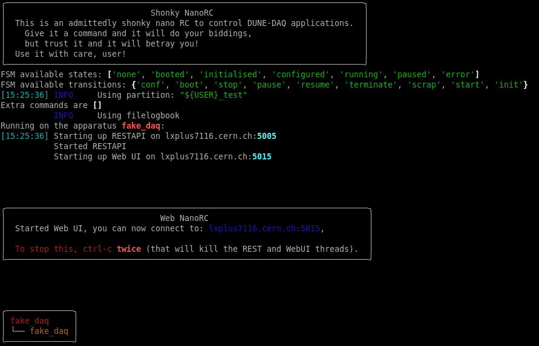

# Nano RC (Not ANOther Run Control)

Poor man's Run Control for DUNE DAQ applications

If you're already familiar with nanorc and wish to troubleshoot a problem, skip to the FAQ [here](FAQ.md)

## How to run me

This tutorial will guide you through the one-host minidaq example.

This tutorial assumes you run on a linux host with /cvmfs mounted, such as lxplus at CERN.

_If you want to run with Kubernetes support, the "Kubernetes support" section is later in this document_

### Setup

First, set up a working area according to [the daq-buildtools instructions](https://dune-daq-sw.readthedocs.io/en/latest/packages/daq-buildtools/).

Information can be found in `daqconf` [wiki](https://github.com/DUNE-DAQ/daqconf/wiki), or in [here](https://dune-daq-sw.readthedocs.io/en/latest/packages/daqconf/InstructionsForCasualUsers/), following is to generate a configuration and run nanorc only.


```bash
fddaqconf_gen -m dro.json -c config.json fake_daq
```

Example contents for `dro.json` and `config.json` can be found in the wiki linked above.

Next (if you want to), you can create a file called `top_level.json` which contains:

```json
{
  "apparatus_id": "fake_daq",
  "minidaq": "fake_daq"
}
```
More lines can be added later, each corresponding to a different config. This allows several sets of apps to be run in the same nanorc instance.

Now you're ready to run.

### Running NanoRC

There are 3 nanorc commands:
 - `nanorc`: for normal development,
 - `nano04rc`: for production environment at NP04,
 - `nanotimingrc`: to run the timing global session.

To see a list of options you can pass `nanorc` in order to control things such as the amount of information it prints and the timeouts for transitions, run `nanorc -h`. We'll skip those for now in the following demo:
```bash
nanorc top_level.json session-name# or "nanorc fake_daq session-name" if you didn't create the top_level.json

╭──────────────────────────────────────────────────────────────────────────╮
│                              Shonky NanoRC                               │
│  This is an admittedly shonky nano RC to control DUNE-DAQ applications.  │
│    Give it a command and it will do your biddings,                       │
│    but trust it and it will betray you!                                  │
│  Use it with care!                                                       │
╰──────────────────────────────────────────────────────────────────────────╯

shonky rc>
```
To see the commands available use `help`.

```
shonky rc> help

Documented commands (type help <topic>):
========================================
boot              exclude         scrap        stop
change_rate       expert_command  shutdown     stop_run
conf              include         start        stop_trigger_sources
disable_triggers  ls              start_run    terminate
drain_dataflow    message         start_shell  wait
enable_triggers   pin_threads     status

Undocumented commands:
======================
exit  help  quit
```

`boot` will start your applications. In the case of the example, a trigger application to supply triggers, a hardware signal interface (HSI) application, a readout application and a dataflow application which receives the triggers.
```bash
shonky rc> boot

  # apps started ━━━━━━━━━━━━━━━━━━━━━━━━━━━━━━━━━━━━━━━━ 100% 0:00:00 0:00:02
  dataflow       ━━━━━━━━━━━━━━━━━━━━━━━━━━━━━━━━━━━━━━━━ 100% 0:00:00 0:00:02
  hsi            ━━━━━━━━━━━━━━━━━━━━━━━━━━━━━━━━━━━━━━━━ 100% 0:00:00 0:00:02
  ruemu0         ━━━━━━━━━━━━━━━━━━━━━━━━━━━━━━━━━━━━━━━━ 100% 0:00:00 0:00:01
  trigger        ━━━━━━━━━━━━━━━━━━━━━━━━━━━━━━━━━━━━━━━━ 100% 0:00:00 0:00:02
                                Apps
┏━━━━━━━━━━┳━━━━━━━━━━━┳━━━━━━━┳━━━━━━━┳━━━━━━━━━━┳━━━━━━━━━━━━━━━━┓
┃ name     ┃ host      ┃ alive ┃ pings ┃ last cmd ┃ last succ. cmd ┃
┡━━━━━━━━━━╇━━━━━━━━━━━╇━━━━━━━╇━━━━━━━╇━━━━━━━━━━╇━━━━━━━━━━━━━━━━┩
│ dataflow │ mu2edaq13 │ True  │ True  │ None     │ None           │
│ hsi      │ mu2edaq13 │ True  │ True  │ None     │ None           │
│ ruemu0   │ mu2edaq13 │ True  │ True  │ None     │ None           │
│ trigger  │ mu2edaq13 │ True  │ True  │ None     │ None           │
└──────────┴───────────┴───────┴───────┴──────────┴────────────────┘

```

You can then send the `start_run`command to get things going. `start_run` requires a run number as argument. It also optionally takes booleans to toggle data storage (`--disable-data-storage` and `--enable-data-storage`) and an integer to control trigger separation in ticks (`--trigger-interval-ticks <num ticks>`).


The Finite State Machine (FSM) is illustrated below. It shows all the transitions available for a normal DAQ application.


The commands produce quite verbose output so that you can see what was sent directly to the applications without digging in the logfiles.

Triggers will not be generated until after a `enable_triggers` command is issued, and then trigger records with 2 links each at a default of 1 Hz will be generated.

Use 'status' to see what's going on:

```bash
shonky rc> status
                                    Apps
┏━━━━━━━━━━┳━━━━━━━━━━━┳━━━━━━━┳━━━━━━━┳━━━━━━━━━━┳━━━━━━━━━━━━━━━━┓
┃ name     ┃ host      ┃ alive ┃ pings ┃ last cmd ┃ last succ. cmd ┃
┡━━━━━━━━━━╇━━━━━━━━━━━╇━━━━━━━╇━━━━━━━╇━━━━━━━━━━╇━━━━━━━━━━━━━━━━┩
│ dataflow │ mu2edaq13 │ True  │ True  │ None     │ None           │
│ hsi      │ mu2edaq13 │ True  │ True  │ None     │ None           │
│ ruemu0   │ mu2edaq13 │ True  │ True  │ None     │ None           │
│ trigger  │ mu2edaq13 │ True  │ True  │ None     │ None           │
└──────────┴───────────┴───────┴───────┴──────────┴────────────────┘
```

When you've seen enough use the `stop_run` or `shutdown` commands. In case you experience timeout problems booting applications or sending commands, consider changing the `hosts` values from `localhost` to the hostname of your machine. This has to do with SSH authentication.

Nanorc commands can be autocompleted with TAB, for example, TAB will autocomplete `ter` to `terminate`. Options like `--disable-data-storage` will be completed with TAB after typing `start_run --d`.

You can also control nanorc in "batch mode", e.g.:
```bash
run_number=999
nanorc fake_daq session-name boot conf start_run --disable-data-storage $run_number wait 2 shutdown
```
Notice the ability to control the time via transitions from the command line via the `wait` argument.


If you want to execute command and be dropped in a shell, you can use `start_shell`:
```bash
run_number=999
nanorc fake_daq session-name boot conf start_run --disable-data-storage $run_number start_shell
```

### Viewing logs and output

Logs are kept in the working directory at the time you started nanorc, named `log_<application name>_<port>.txt`, or, if you are running `nano04rc` in `/log/` on the host in which the application is running;..

You can look at the header and the value of attributes in the hdf5 file using:

```bash
h5dump-shared -H -A swtest_run000103_0000_*.hdf5
```
(your file will be named something else, of course).

To get the TriggerRecordHeaders and FragmentHeaders:

```bash
hdf5_dump.py -p both -f swtest_run000103_0000_*.hdf5
```

## More on boot

It can be instructive to take a closer look at how we can tell nanorc to `boot` the DAQ's applications. Let's take a look at a relatively simple example file in the nanorc repo, `examples/ruemu_conf/boot.json`:
```json
{
    "apps": {
        "dataflow0": {
            "exec": "daq_application_ssh",
            "host": "dataflow0",
            "port": 3338
        },
        "dfo": {
            "exec": "daq_application_ssh",
            "host": "dfo",
            "port": 3335
        },
        [...]
    },
    "env": {
        "DUNEDAQ_ERS_DEBUG_LEVEL": "getenv_ifset",
        "DUNEDAQ_ERS_ERROR": "erstrace,throttle,lstdout",
        "DUNEDAQ_ERS_FATAL": "erstrace,lstdout",
        "DUNEDAQ_ERS_INFO": "erstrace,throttle,lstdout",
        "DUNEDAQ_ERS_VERBOSITY_LEVEL": "getenv:1",
        "DUNEDAQ_ERS_WARNING": "erstrace,throttle,lstdout"
    },
    "exec": {
        "daq_application_ssh": {
            "args": [
                "--name",
                "{APP_NAME}",
                "-c",
                "{CMD_FAC}",
                "-i",
                "{INFO_SVC}",
                "--configurationService",
                "{CONF_LOC}"
            ],
            "cmd": "daq_application",
            "comment": "Application profile using PATH variables (lower start time)",
            "env": {
                "CET_PLUGIN_PATH": "getenv",
                "CMD_FAC": "rest://localhost:{APP_PORT}",
                "DETCHANNELMAPS_SHARE": "getenv",
                "DUNEDAQ_SHARE_PATH": "getenv",
                "INFO_SVC": "file://info_{APP_NAME}_{APP_PORT}.json",
                "LD_LIBRARY_PATH": "getenv",
                "PATH": "getenv",
                "TIMING_SHARE": "getenv",
                "TRACE_FILE": "getenv:/tmp/trace_buffer_{APP_HOST}_{DUNEDAQ_PARTITION}"
            }
        }
    },
    "external_connections": [],
    "hosts": {
        "dataflow0": "localhost",
        "dfo": "localhost",
        "dqm0-df": "localhost",
        "dqm0-ru": "localhost",
        "hsi": "localhost",
        "ruemu0": "localhost",
        "trigger": "localhost"
    },
    "response_listener": {
        "port": 56789
    }
}
```
...you'll notice a few features about it which are common to boot files. Looking at the highest-level keys:

* `apps` contains the definition of what applications will run, and what sockets they'll be controlled on
* `env` contains a list of environment variables which can control the applications
* `hosts` is the cheatsheet whereby `apps` maps the labels of hosts to their actual names
* `exec` defines the exact procedure by which an application will be launched
* `external_connections` is a list of external connections
* `response_listener` shows on which port of localhost nanorc should expect the responses from the applications when commands are sent.

It should be pointed out that some substitutions are made when nanorc uses a file such as this to boot the processes. Specifically:

* `"getenv"` is replaced with the actual value of the environment variable, throwing a Python exception if it is unset
* `"getenv:<default value>"` is replaced with the actual value of the environment variable if it is set, with `<default value>` used if it is unset
* `"getenv_ifset"` is replaced with the actual value of the environment variable if it is set, otherwise nanorc doesn't set this variable
* If a host is provided as `localhost` or `127.0.0.1`, the result of the Python call `socket.gethostname` is used in its place
* `{APP_NAME}` is replaced by the app key name by nanorc
* `{CMD_FAC}` and `{INFO_SVC}` are replaced by their corresponding environment value
* `{CONF_LOC}` is replaced by a path to a local directory containing the configuration data that the application must be able to see.


## How to run WebUI

To access the WebUI, add the --web option when running nanorc. When nanorc starts up, it will display a box like this :



which shows what lxplus node to connect to (in dark blue in the picture above lxplusXXXX.cern.ch).

Before you can connect, a SOCKS proxy must be set up to that node in another terminal window, using `ssh -N -D 8080 username@lxplusXXXX.cern.ch` and substituting XXXX with whatever number is shown.

Once you have set up your browser to use a SOCKS proxy, connect to the address in the browser, and you should see something like this:


From here, using nanorc is just about the same as in the terminal:

*  transitions between FSM states can be done using the State Control Buttons,
*  the information that nanorc outputs can be viewed by clicking the expansion triangle under "Last response from nanorc" to see the details of the response.

**Note that this information will also be shown as output to the terminal.**

## How to run the TUI

To use the TUI (Terminal User Interface), add the --tui option when running nanorc. No proxy is required in this case.


Again, using nanorc is similar to the terminal:

* Transitions between states are done with the buttons in the top right: press I on the keyboard to toggle whether optional inputs are taken.
* Logs are displayed in the bottom right, and can be searched by typing in the box above them.

## Kubernetes support

This page describes the functionality which is supported within Kubernetes in v4.2.0.

### Requirements
Before you go off and try this, you at least need to have:
* A k8s cluster running. To check that this is the case, you can head to the dashboard (on the NP04 cluster, that's [here](http://np04-srv-016:31001), after you have setup a SOCKS proxy to lxplus).
* All the nodes being able to access `/cvmfs`.
* A shared NFS between all the hosts that are running DAQ applications.

All of this is available on the NP04 cluster.

### Overview

The Kubernetes prototype process manager in nanorc knows about many types of DUNE DAQ applications: applications that require access to FELIX card, applications that require Ethernet readout, and other application. Applications are booted in the order provided by `boot.json`. There is no affinity set, if the user wants to run an application on different node, he/she will have to specify during the configuration.

Applications are run in `pods` with a restart policy of never, so failing applications are not restarted.

Nanorc makes use of a set of `microservices` either outside the k8s cluster or inside, in addition to the other services running on the NP04 cluster.

#### Sessions and resource management

Sessions are supported to the same level that they are in the ssh process manager version of nanorc, that is two or more instances of nanorc may be run concurrently.

The `k8s` version implements a first version of resource management: Felix cards and data storage (?) cannot be claimed by more than one session. Readout apps start on the hosts specified in the configuration, all other apps have anti-affinity with readout apps, so start on other hosts.

### NP04 cluster

Up to date documentation on the k8s test cluster at NP04 is [here](https://twiki.cern.ch/twiki/bin/view/CENF/K8sDAQpilot), and the node assignment is [here](https://twiki.cern.ch/twiki/bin/view/CENF/ComputerAssignments)

## Walkthrough to run your app on k8s at NP04:

### Getting started
Log on to the np04 cluster and follow the instructions in [here](https://twiki.cern.ch/twiki/bin/view/CENF/K8sDAQpilot).
2 important notes:
* You **do not** need to be on any particular node to use nanorc and K8s. But you will need to have the correct `KUBECONFIG` properly set as described in the previous link.
* You **do not** need to create your namespace. That is handled automatically by nanorc.

#### Setup the nightly/release
Using the instructions at this [link](https://dune-daq-sw.readthedocs.io/en/latest/packages/daq-buildtools/#setup-of-daq-buildtools), set up a work area or a release.

#### Generate a configuration and upload it on the configuration service
Create a fddaqconf file as such (named `config.json` in the rest of the instructions):
```json
{
    "boot": {
        "ers_impl": "cern",
        "opmon_impl": "cern",
        "process_manager": "k8s"
    }
    [rest of your config...]
}
```

Next, you need to generate the configuration:
```bash
fddaqconf_gen -m dro.json -c config.json daq-config
```

You can follow instructions in [daqconf wiki](https://github.com/DUNE-DAQ/daqconf/wiki) to populate `dro.json` and `config.json`.

#### Run nanorc
... **after** unsetting the proxy.
```bash
source ~np04daq/bin/web_proxy.sh -u
nanorc --pm k8s://np04-srv-016:31000 daq-config session-name
nanorc> [...]
nanorc> boot
nanorc> start_run 12345
nanorc> [...]
```

### K8s dashboard, logs and monitoring
#### K8s dashboard
Hop on the [K8s dashboard](http://np04-srv-016:31001/) (after setting up a web SOCKS proxy to `lxplus` if you are not physically at CERN) to check the status of the cluster. Note you will need to select the session you used to start nanorc, this is the k8s namespace. You will be able to see if the pods are running or not, and where.

#### Log on a pod
First, do
```bash
> kubectl get pods -n session-name
NAME        READY   STATUS    RESTARTS   AGE
dataflow0   1/1     Running   0          66s
...
```
to get a list of pods corresponding to DAQ applications. This should be run from the node that hosts the control plane, which is `np04-srv-015`. (The control plane is a collection of top level components that manage the whole kubernetes cluster, including the API server and a data store that keeps track of current/desired state.)

Now do:
```bash
kubectl exec -n session-name --stdin --tty dataflow0 -- /bin/bash
```
to log on the pod which runs the dataflow app.

#### Logs
To get the log, open a new terminal window on `np04-srv-016`, on which k8s is already installed, and do:

```bash
kubectl get pods -n session-name
```

Note: `session-name` is given as a parameter to the `nanorc` command.
```bash
> kubectl get pods -n session-name
NAME        READY   STATUS    RESTARTS   AGE
dataflow0   1/1     Running   0          66s
...
```
And you can use the pod name with the `kubectl logs` command:
```bash
> kubectl logs dataflow0 -n session-name
```

If by any "chance" something terrible happened with your pod and it core dumped for example, the k8s may either try to restart it, or give up. You can still view the stdout/stderr logs by doing:

```bash
> kubectl logs dataflow0 -n session-name --previous
```

#### Monitoring and Grafana
Go to [Grafana](http://np04-srv-017:31023/) and select your session on the left.

### "Feature" list:
 - `daq_applications` live in pods (not deployments), with k8s pod restart policy of "Never".
 - mounts `cvmfs` in the pod (`dunedaq` and `dunedaq-development`).

